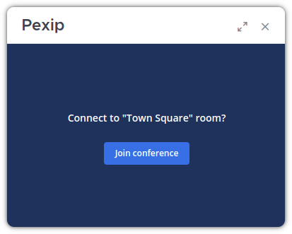
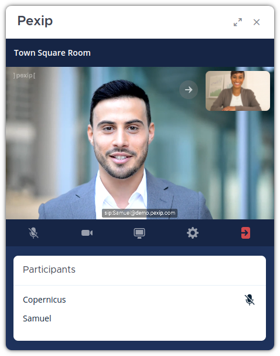
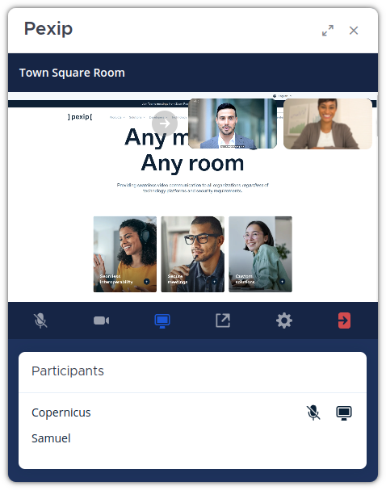

# Pexip Video Connect Plugin for Mattermost

Start a video conference from any channel with several participants without leaving Mattermost. You will be able to share your screen and even join through SIP devices.

For more information and get all the possibilities, visit https://pexip.com.

## Requirements

For using this plugin you need to comply with the following requirements:

- Mattermost server v6.2.1 or higher.
- Pexip Infinity Management node v31 or higher.
- At least one Pexip Infinity Conferencing node v32 or higher.
- A valid Pexip License.

## Configuration

In this section you will learn how to make a proper configuration. The configuration that you have to make is divided in two different steps.

First you will need to define the configuration in the Pexip Infinity Management node. Here you will define how to treat the incoming conferences.

In the second step, you will define the configuration of the Pexip Plugin inside Mattermost. This configuration should match the one that you defined in the previous step.

### Step 1: Configure Pexip Infinity

We will start by defining our configuration in the Pexip Infinity Management node:

- Open the Pexip Infinity Management node web interface. 

- Go to **Call Control > Policy Profiles**.

- Click on **Add Policy profile**.

- Define a name for the new profile.

- In **Service configuration policy** check the box **Apply local policy**.

- Copy the following script, but not forget to modify the `prefix` and `agentPin` with the values that you want for your deployment:

  ```jinja
  
  
  
    {
      "action": "continue",
      "result": {
        "service_type": "conference",
        "name":  {{'"'}}{{call_info.local_alias | pex_regex_replace("^" + prefix, "") }}{{'"'}},
        "service_tag": "Mattermost",
        "pin": agentPin,
        "allow_guests": true,
        "crypto_mode": "besteffort",
        "view": "five_mains_seven_pips",
        "enable_overlay_text": true
      }
    }
  
    {
      "action" : "continue",
      "result" : {{service_config|pex_to_json}}
    }
  
    {
      "action" : "reject",
      "result" : {}
    }
  
  ```
- Click on "Save" and you will have your new policy in the system.

The last step is to assign the new policy to a Location:

- Open the Pexip Infinity Management node web interface.
- Go to **Platform > Locations**.
- Select the location that you want to use for Mattermost.
- In the section **Policy profile** select the policy that you have created before.

### Step 2: Configure the Mattermost Plugin

Now we will enable the plugin and set the configuration:

- Open the admin web page: `https://<mattermost-domain>/admin_console`

- Go to the left menu and under the **Plugins** section you should see **Pexip Video Connect**. Click on that plugin to show the plugins menu.

- Configure the following parameters:

  - **Enable Plugin:** `true`

  - **Pexip Infinity Server:** Domain or IP of your Conferencing Node (e.g. `pexipdemo.com` or `192.168.1.100`).

  - **VMR prefix:** It will attach a prefix to the Mattermost Channel name. For example, if the channel name is `Town Square` and the prefix `matt-`, the system will use the VMR `matt-town-square`. You will need to use the same prefix that you used for the **Pexip Infinity configuration**.

    > **Warning**
    > You will need to use the same prefix that you used for the **Pexip Infinity configuration**.

  - **Host PIN:** This PIN is used for all the VMR for connecting as an host.

    > **Warning**
    > You will need to use the same host pin that you used for the **Pexip Infinity configuration**.

  - **Embedded Experience:** Set it to `true` if you want the integrated experience and the video conference will be displayed inside the Mattermost interface. If you set it to `false` a new window with the **Pexip Web App 3** will be opened.

## Using the Plugin

Once the plugin is installed, enabled and properly configured, all the users will see a new button on the top-right of their interface:

<p align="center">
  
</p>

The behavior of this button will depend on the configuration that you have defined for the Plugin. In case you have defined the **Embedded Experience** to `false`, it will open the Pexip Web App 3 in another window. In case this value is `true`, you will see a panel for starting the conference.

<p align="center">
  
</p>

> **Info**
> The plugin only works for conferences inside channels. This means that it won't be available for one-to-one calls or for bots. Also, take into account that in this section we will only discuss the **Embedded Experience**. If you want more information about the Web App 3, consult the [Web App 3 Documentation](https://docs.pexip.com/clients/using_webapp3.htm).


For starting the conference, you only have to click on the **Join conference** button. Once You have done that, you will see the conference itself.

<p style="width: 512px; margin: auto">
  
</p>

During the conference you will be able to perform the following actions:

- **Mute audio:** You can enable or disable your microphone with the first button.
- **Mute video:** You can also choose if the camera feed should be available for others.
- **Receive a presentation:** If other participant start sharing his screen, you will be able to see the video without performing any additional action.
- **Send presentation:** In case you want to share your screen, you only have to click on the third button. This will open a pop-up to choose what you want to share (whole screen, window or tab).
- **Disconnect:** The last button is for disconnecting for the conference.

If a user is sharing the screen, you will be able to choose what to see in the main area (screensharing or video with the remote participants). To toggle between these two options, you have to click on the video thumbnail located on the top-right corner.

<p style="width: 512px; margin: auto">
  
</p>

## Frequently Asked Questions

### Do I need a Pexip license to use this plugin?

You will need a Pexip license for your Pexip Infinity deployment. Contact Pexip for [more information or booking a demo](https://www.pexip.com/demo).

### Is recording supported?

You can record the conferences, but it needs and extra integration with a RTMP service. More information in the [streaming and recording documentation](https://docs.pexip.com/admin/streaming.htm).


### Is there any possibility of interoperability with Microsoft Teams, Google Meet or SIP devices?

Yes, in Pexip we work very hard on interoperability with a lot of other video conference providers. This way, you will have several options to choose in our portfolio.

## Development

This plugin contains both a server and web app portion. If you want information about how to compile the plugin and test it in a development environment, visit the [developer guide](docs/DEVELOPMENT.md).
