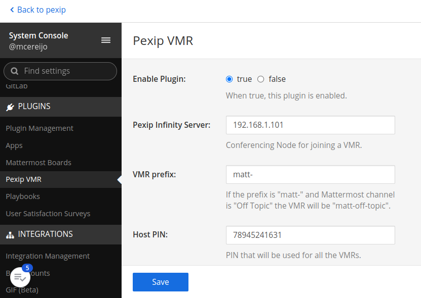
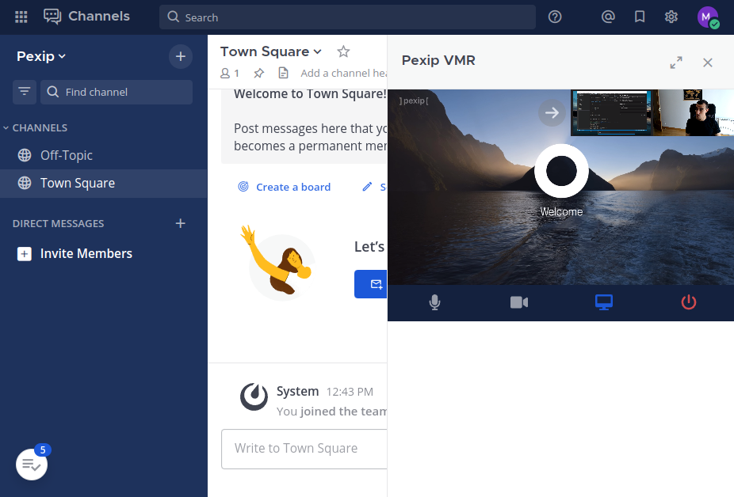

# Pexip Mattermost Plugin

Mattermost is a chat application that can be deployed on-premises. The key feature is that is allows to developers to create their own plugin (server and client side) and integrations.

The goal of this project is to develop and simple plugin that allow us to call to VMRs per channel.

## Admin page


## Active conference


## Deploy the server locally (Manual)

We can run a docker container directly with the following command:

```bash
$ docker run --name mattermost-preview -d --publish 8065:8065 mattermost/mattermost-preview
```

## Generate plugin bundle

1. Install npm dependencies:

```bash
$ npm run install
```

2. Create javascript file for production:

```bash
$ npm run build
```

3. Create bundle (tgz for uploading to mattermost)

```bash
$ npm run bundle
```

## Upload plugin to mattermost platform

These are the steps to deploy the plugin in our local environment:

1. Launch mattermost in a web browser: https://localhost:8065

2. Introduce all the mandatory info: username, password, organization, url, etc.

3. Open the admin web page: https://localhost:8065/admin_console

4. In the left menu go to the "Plugins" section and there select "Plugin Management".

5. In the section "Upload Plugin" click on "Choose File" and select the file "com.pexip.pexip-vmr.gz".

6. Click on "Upload".

7. Go to the left menu and under the "Plugins" section you should see "Pexip VMR". Click on that plugin to show the plugins menu.

8. In the "Enable Plugin" section select "true".

## Configure the plugin

1. Open the admin web page: https://localhost:8065/admin_console

2. In the left menu go to the "Plugins/Pexip VMR".

3. Configure the following parameters:

   - Pexip Infinity Server: Domain or IP of your Conferencing Node.

   - VMR prefix: It will attach a prefix to the Mattermost Channel name. For example, if the channel name is "Town Square" and the prefix "matt-", the system will use the VMR "matt-town-square".

   - Host PIN: This PIN is used for all the VMR for connecting as an host.

## Populate the VMRs

Here you have several alternatives:

- Create the VMR by hand (for dev): You will need to create a VMR per Mattermost Channel. For the channel "Town Square" and prefix "matt-" we should create a VMR with the alias "matt-town-square". Take into account that if you create a new Mattermost Channel, you should also create a new VMR.
  
- Use the Local Policy (recommended): We have define a prefix which should help to create a Local Policy for all the Mattermost Channels. 

```


  {
    "action": "continue",
    "result": {
      "service_type": "conference",
      "name":  {{'"'}}{{call_info.local_alias | pex_regex_replace("^matt-", "") }}{{'"'}},
      "service_tag": "Mattermost",
      "description": "",
      "pin": "1234",
      "allow_guests": true,
      "crypto_mode": "besteffort",
      "view": "five_mains_seven_pips",
      "enable_overlay_text": true
    }
  }

  {
    "action" : "continue",
    "result" : {{service_config|pex_to_json}}
  }

  {
    "action" : "reject",
    "result" : {}
  }

```

